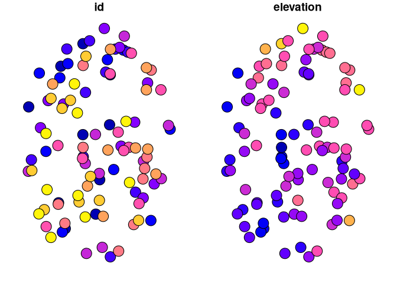
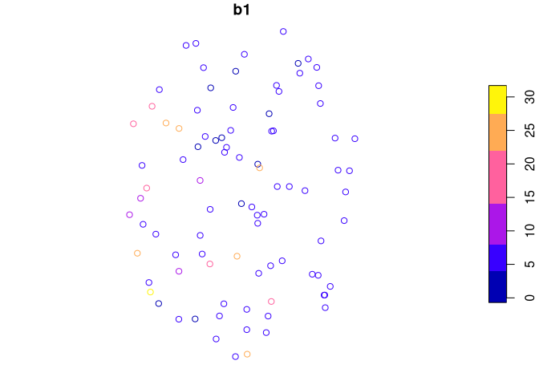
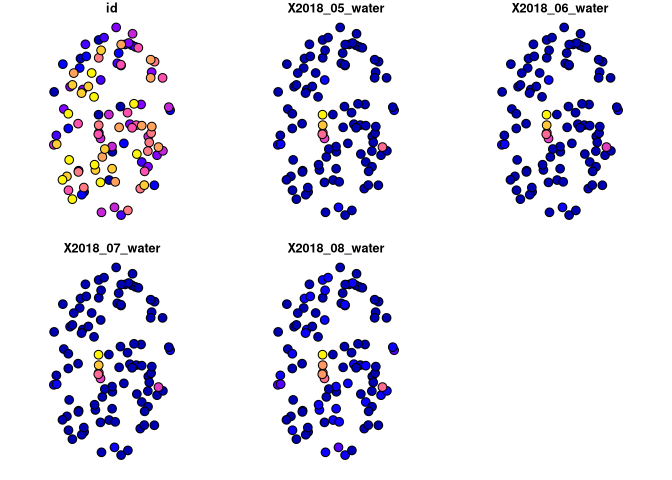
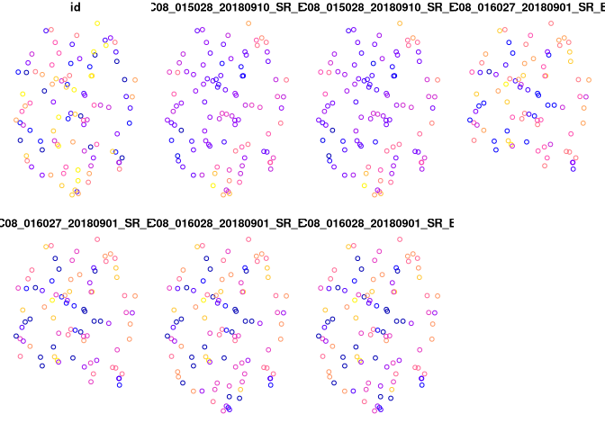

# targets-rgee-extract

<!-- -->

### Sample image with polygons

For example, extract the maximum elevation in each polygon
(“elevation”):

``` r
tar_load(sample_image_with_polys)
head(sample_image_with_polys)
```

    ## Simple feature collection with 6 features and 2 fields
    ## Geometry type: POLYGON
    ## Dimension:     XY
    ## Bounding box:  xmin: -74.83679 ymin: 46.41328 xmax: -74.72176 ymax: 46.53996
    ## Geodetic CRS:  WGS 84
    ##   id elevation                       geometry
    ## 1  1       277 POLYGON ((-74.82771 46.4962...
    ## 2  2       323 POLYGON ((-74.73499 46.4376...
    ## 3  3       292 POLYGON ((-74.73261 46.4810...
    ## 4  4       315 POLYGON ((-74.79072 46.4221...
    ## 5  5       373 POLYGON ((-74.7963 46.53405...
    ## 6  6       310 POLYGON ((-74.72462 46.5243...

``` r
plot(sample_image_with_polys)
```

<!-- -->

### Sample image with points

For example, extract the leading tree species at each point (“b1”):

``` r
tar_load(sample_image_with_points)
head(sample_image_with_points)
```

    ## Simple feature collection with 6 features and 2 fields
    ## Geometry type: POINT
    ## Dimension:     XY
    ## Bounding box:  xmin: -74.83523 ymin: 46.41165 xmax: -74.6694 ymax: 46.50514
    ## Geodetic CRS:  WGS 84
    ##   id b1                   geometry
    ## 1  1  6  POINT (-74.6694 46.49735)
    ## 2  2  6 POINT (-74.67346 46.41165)
    ## 3  3  6  POINT (-74.72348 46.4236)
    ## 4  4 NA POINT (-74.82548 46.50514)
    ## 5  5 26 POINT (-74.83523 46.43082)
    ## 6  6  6  POINT (-74.7969 46.48492)

``` r
plot(sample_image_with_points['b1'])
```

<!-- -->

### Sample image collections with polygons

For example, extract the monthly water detection within polygons (2 =
water, 1 = land)

``` r
tar_load(sample_image_collection_with_polygons)
head(sample_image_collection_with_polygons)
```

    ## Simple feature collection with 6 features and 5 fields
    ## Geometry type: POLYGON
    ## Dimension:     XY
    ## Bounding box:  xmin: -74.83679 ymin: 46.41328 xmax: -74.72176 ymax: 46.53996
    ## Geodetic CRS:  WGS 84
    ##   id X2018_05_water X2018_06_water X2018_07_water X2018_08_water
    ## 1  1       1.000681       1.000681       1.000000      1.0000000
    ## 2  2       1.007217       1.007104       1.003295      0.9961297
    ## 3  3       1.000000       1.000000       1.000000      1.0000000
    ## 4  4       1.000000       1.000000       1.000000      1.0000000
    ## 5  5       1.054149       1.054125       1.050400      1.0458816
    ## 6  6       1.045094       1.042770       1.030042      1.0262809
    ##                         geometry
    ## 1 POLYGON ((-74.82771 46.4962...
    ## 2 POLYGON ((-74.73499 46.4376...
    ## 3 POLYGON ((-74.73261 46.4810...
    ## 4 POLYGON ((-74.79072 46.4221...
    ## 5 POLYGON ((-74.7963 46.53405...
    ## 6 POLYGON ((-74.72462 46.5243...

``` r
plot(sample_image_collection_with_polygons)
```

<!-- -->

### Sample image collections with points

For example, Landsat 8 bands at each point:

``` r
tar_load(sample_image_collection_with_points)
head(sample_image_collection_with_points)
```

    ## Simple feature collection with 6 features and 7 fields
    ## Geometry type: POINT
    ## Dimension:     XY
    ## Bounding box:  xmin: -74.83523 ymin: 46.41165 xmax: -74.6694 ymax: 46.50514
    ## Geodetic CRS:  WGS 84
    ##   id LC08_015028_20180910_SR_B1 LC08_015028_20180910_SR_B2
    ## 1  1                      29472                      29089
    ## 2  2                      29612                      29295
    ## 3  3                      30448                      30169
    ## 4  4                      30526                      30103
    ## 5  5                      27204                      26891
    ## 6  6                      28946                      28574
    ##   LC08_016027_20180901_SR_B1 LC08_016027_20180901_SR_B2
    ## 1                      32351                      32438
    ## 2                      30442                      30326
    ## 3                      26421                      26480
    ## 4                      14816                      14795
    ## 5                      34922                      34877
    ## 6                      37775                      37170
    ##   LC08_016028_20180901_SR_B1 LC08_016028_20180901_SR_B2
    ## 1                      32223                      32290
    ## 2                      30206                      30091
    ## 3                      26532                      26603
    ## 4                      15209                      15266
    ## 5                      34706                      34309
    ## 6                      37225                      36657
    ##                     geometry
    ## 1  POINT (-74.6694 46.49735)
    ## 2 POINT (-74.67346 46.41165)
    ## 3  POINT (-74.72348 46.4236)
    ## 4 POINT (-74.82548 46.50514)
    ## 5 POINT (-74.83523 46.43082)
    ## 6  POINT (-74.7969 46.48492)

``` r
plot(sample_image_collection_with_points)
```

<!-- -->

Note - these are spread wide, where each measure is a new column. That
means they will likely need to be restructured for further processing.

## Setup

First time using this project:

``` r
Sys.setenv(DOWNLOAD_STATIC_LIBV8 = 1)
install.packages('renv')
renv::restore()
rgee::ee_Authenticate()
rgee::ee_Initialize(drive = TRUE)
```

### Dependencies

Details for `rgee` here:
<https://r-spatial.github.io/rgee/articles/rgee01.html#installation>

#### System dependencies

-   gcloud (<https://cloud.google.com/sdk/docs/install>)
-   python \>= 3.5
-   earthengine python package

#### `rgee`

The “first time” section above should get you set up, but if you are
starting from scratch:

**Install**:

``` r
library(rgee)
ee_install(py_env = 'rgee')
```

**Authenticate**:

``` r
ee_Initialize()
```

**Check**:

``` r
ee_check()
```

Renv + python:

``` r
renv::use_python(reticulate::py_discover_config()$python)
renv::snapshot()
```
